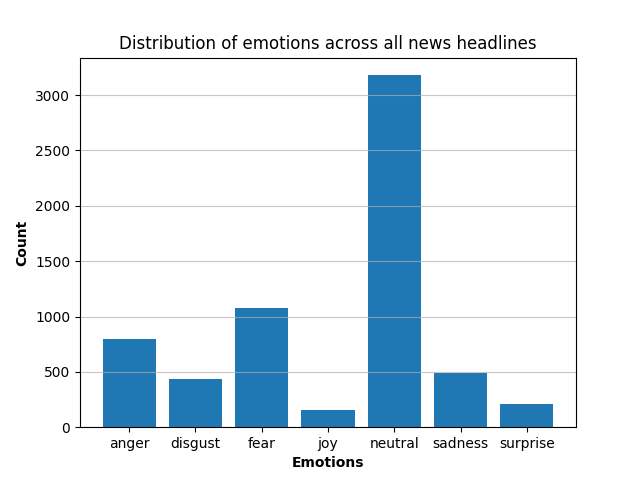
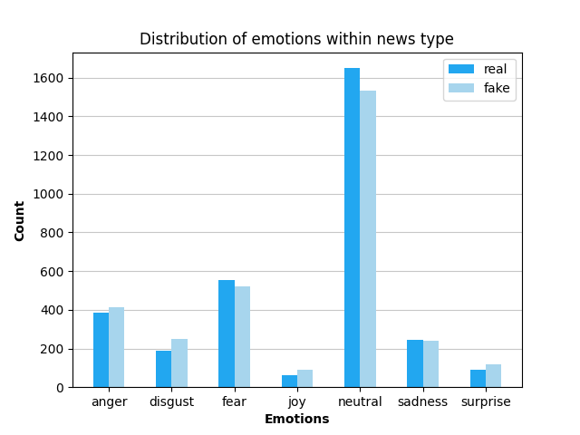

# Assignment 4 - Using finetuned transformers via HuggingFace

For this assignment, you should use ```HuggingFace``` to extract information from the *Fake or Real News* dataset that we've worked with previously.

You should write code and documentation which addresses the following tasks:

- Initalize a ```HuggingFace``` pipeline for emotion classification
- Perform emotion classification for every *headline* in the data
- Assuming the most likely prediction is the correct label, create tables and visualisations which show the following:
  - Distribution of emotions across all of the data
  - Distribution of emotions across *only* the real news
  - Distribution of emotions across *only* the fake news
- Comparing the results, discuss if there are any key differences between the two sets of headlines


## Student edit
### Solution
The code written for this assignment can be found within the ```src``` directory. The directory contains the script ```analysis.py``` which is designed to be run from the terminal. _The script assumes that ```src``` is the working directory_. The script performs text classification on the data in the ```data``` directory, using the ```HuggingFace``` pipeline ```j-hartmann/emotion-english-distilroberta-base```. The data consists of real and fake news headlines and articles. Each headline is classified as displaying one of seven emotions. The script outputs a ```csv```-file in ```out``` that contains the original data with an added column indicating the sentiment/emotion classification of the headline. The script also produces two plots in ```out```. One shows the count distribution of emotions across the entire data set. The other shows a count distribution of emotions within real and fake news headlines.

### Results
In the figure below we see that by far most headlines are classified as neutral. The specific count values can be seen in the table following the plot.



| Emotion | Count |
|---------|-------|
|Anger|795|
|Disgust|434|
|Fear|1076|
|Joy|155|
|Neutral|3180|
|Sadness|487|
|Surprise|208|

<br><br>
Looking at real and fake headlines seperately, as in the figure below, we see that the distribution of emotions is quite similar for both types of headlines. Given this clear similarity, it is possible that balancing sentiment across real and fake news was an explicit goal of the creator of the data set. Or it is simply an impressive result of the fake news generator model.  



### Setup
The data must be dowloaded from [here](https://www.kaggle.com/datasets/jillanisofttech/fake-or-real-news) and saved in the ```data``` directory.

The script requires the following to be run from the terminal:

```shell
bash setup.sh
```

This will create a virtual environment, ```assignment4_env``` (git ignored), to which the packages listed in ```requirements.txt``` will be downloaded. __Note__, ```setup.sh``` works only on computers running POSIX. Remember to activate the environment running the following line in a terminal before changing the working directory to ``src`` and running  ```analysis.py```.

```shell 
source ./assignment4_env/bin/activate
```
